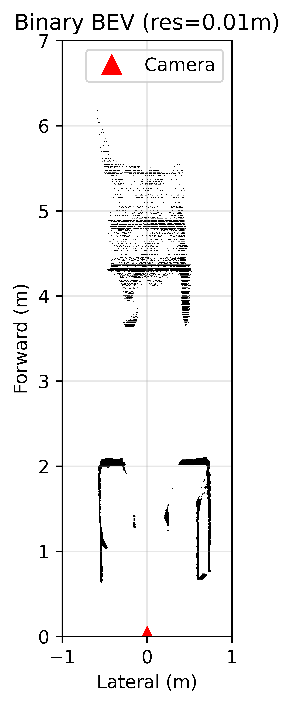
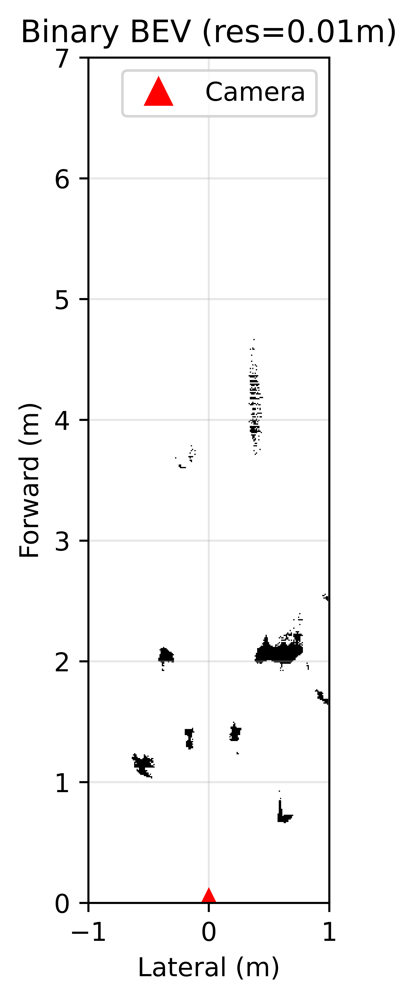

# radar-camera-bev-evaluation

Comparative evaluation of **mmWave radar** and **depth camera** 2D occupancy grids against hand-measured ground truth in a controlled indoor environment.

## What This Project Does

Both sensors observe the same static indoor scene (a narrow hallway with obstacles). Each sensor produces a binary occupancy grid — a top-down map where each cell is either "occupied" or "free". This project evaluates how accurately each sensor reconstructs the scene by comparing its occupancy grid against ground truth measurements.

## Sensors

| Sensor | Model | Key Specs |
|--------|-------|-----------|
| Radar | TI xWR68xx AOP | 3TX × 4RX, Capon/Bartlett beamforming, 0.044m range res |
| Camera | Intel RealSense D455 | 848×480 depth, 86° FOV, stereo IR |

## Scenes

Room: 122cm wide hallway, sensor 55cm from left wall, front wall at 201cm.

| Scene | Description |
|-------|-------------|
| 1 | Suitcase (indoor)  |
| 2 | Mirror |
| 3 | Suitcase (outdoor) |

Each scene tested under **light** and **dark** conditions. Camera additionally tested with/without IR projector.

## Results

### Scene Comparison (Light condition)

| Scene | Radar light | Camera light | Radar Dark | Camera Dark | GT |
|:-----:|:---------:|:----------:|:--:|:-------------:|:--------------:|
| 1 — Suitcase |  |   |  |  |  |
| 2 — Mirror |  |  |  |  | |
| 3 — Suitcase(OutDoor) |  |  |          |         |  |

### Grid-level Metrics
### Whole environment

| Scene | Light | Sensor | Position   |IoU | Precision | Recall | F1 |   free space acc   |
|:-----:|:------:|:---:|:---------:|:------:|:--:|:--:||:--:|
| 1 | light | camera  |   1    | 0.1930 | 0.5445 | 0.2301 | 0.3235 | 0.9304 |
| 1 | light | camera  |   2    | 0.1860 | 0.5369 | 0.2216 | 0.3137 | 0.9300 | 
| 1 | light | camera  |   3    | 0.1848 | 0.5347 | 0.2202 | 0.3120 | 0.9299 | 
| 1 | light | camera  |   4    | 0.1868 | 0.5451 | 0.2214 | 0.3149 | 0.9300 | 
| 1 | light | camera  |   5    | 0.1790 | 0.5289 | 0.2131 | 0.3037 | 0.9293 | 
| 1 | light | camera  |   6    | 0.1827 | 0.5365 | 0.2170 | 0.3090 | 0.9296 | 
| 1 | light | camera  |   7    | 0.1793 | 0.5361 | 0.2222 | 0.3041 | 0.9286 | 
| 1 | light | camera  |   8    | 0.1789 | 0.5342 | 0.2120 | 0.3036 | 0.9285 | 
| 1 | light | camera  |   9    | 0.1877 | 0.5492 | 0.2218 | 0.3160 | 0.9294 | 

| 2 | light | camera  |   1    | 0.1930 | 0.5445 | 0.2301 | 0.3235 | 0.9304 |
| 2 | light | camera  |   2    | 0.1860 | 0.5369 | 0.2216 | 0.3137 | 0.9300 | 
| 2 | light | camera  |   3    | 0.1848 | 0.5347 | 0.2202 | 0.3120 | 0.9299 | 
| 2 | light | camera  |   4    | 0.1868 | 0.5451 | 0.2214 | 0.3149 | 0.9300 | 
| 2 | light | camera  |   5    | 0.1790 | 0.5289 | 0.2131 | 0.3037 | 0.9293 | 
| 2 | light | camera  |   6    | 0.1827 | 0.5365 | 0.2170 | 0.3090 | 0.9296 | 
| 2 | light | camera  |   7    | 0.1793 | 0.5361 | 0.2222 | 0.3041 | 0.9286 | 
| 2 | light | camera  |   8    | 0.1789 | 0.5342 | 0.2120 | 0.3036 | 0.9285 | 
| 2 | light | camera  |   9    | 0.1877 | 0.5492 | 0.2218 | 0.3160 | 0.9294 | 

| 1 | light | Camera | 0.2254 | 0.6837 | 0.2516 | 0.3678 |
| 1 | dark  | Radar  | 0.0351	| 0.2795 | 0.0386 | 0.0679 |
| 1 | dark  | Camera | 0.1485 | 0.4790 | 0.1771 | 0.2586 |
| 2 | light | Radar  | 0.0046 | 0.1250 | 0.0048 | 0.0092 |
| 2 | light | Camera | 0.1544 | 0.2869 | 0.2506 | 0.2676 | 
| 2 | dark  | Radar  | 0.0046 | 0.1232 | 0.0048 | 0.0092 |
| 2 | dark  | Camera | 0.0888 | 0.4192 | 0.1013 | 0.1632 |
| 3 | light | Radar  | 0.1487 | 0.5379 | 0.1705 | 0.2589 |
| 3 | light | Camera | 0.2810 | 0.8944 | 0.2906 | 0.4387 |

### Cluster-level Metrics

| Scene | Sensor | Hungarian Mean Error (m) | OSPA (m) | OSPA_loc | OSPA_card |
|:-----:|:------:|:------------------------:|:--------:|:--------:|:---------:|
| 1 | Radar  | 0.1165 | 0.1165 | 0.1165 | 0 |
| 1 | Camera | 0.0821 | 0.0821 | 0.0821 | 0 |
| 2 | Radar  | 0.1179 | 0.1179 | 0.1179 | 0 |
| 2 | Camera | —      | 0.1500 | 0.0866 | 0.1225 |
| 3 | Radar  | 0.0679 | 0.0679 | 0.0679 | 0 |
| 3 | Camera | 0.0728 | 0.0728 | 0.0728 | 0|

