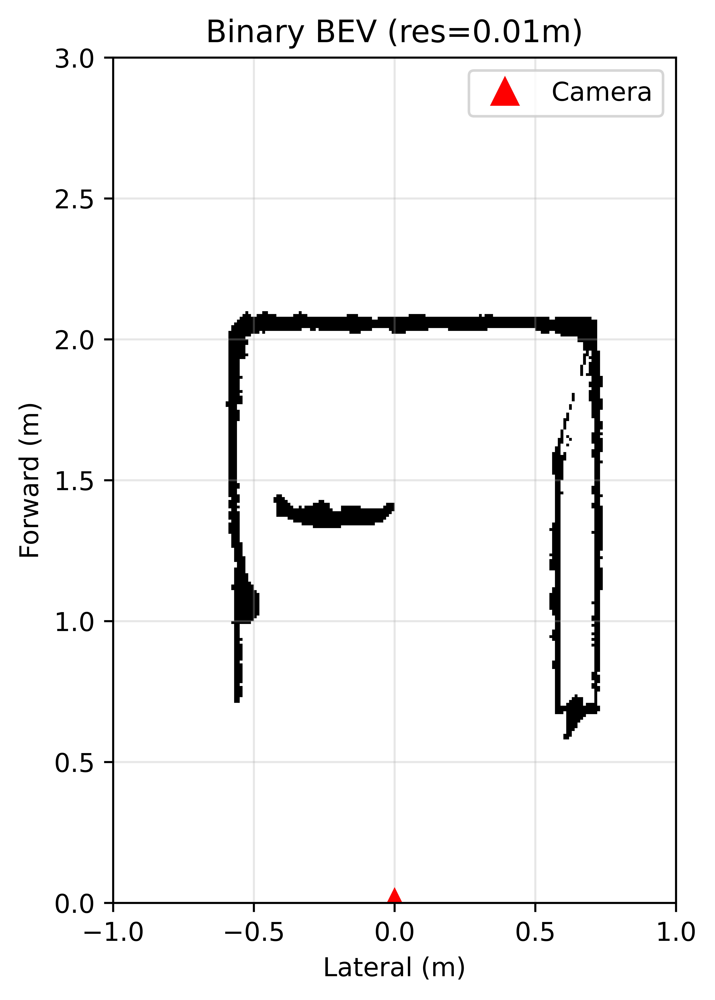

# radar-camera-bev-evaluation

Comparative evaluation of **mmWave radar** and **depth camera** 2D occupancy grids against hand-measured ground truth in a controlled indoor environment.

## What This Project Does

Both sensors observe the same static indoor scene (a narrow hallway with obstacles). Each sensor produces a binary occupancy grid — a top-down map where each cell is either "occupied" or "free". This project evaluates how accurately each sensor reconstructs the scene by comparing its occupancy grid against ground truth measurements.

## Sensors

| Sensor | Model | Key Specs |
|--------|-------|-----------|
| Radar | TI xWR68xx AOP | 3TX × 4RX, Capon/Bartlett beamforming, 0.044m range res |
| Camera | Intel RealSense D455 | 848×480 depth, 86° FOV, stereo IR |

## Scenes

Room: 122cm wide hallway, sensor 55cm from left wall, front wall at 201cm.

| Scene | Description |
|-------|-------------|
| 1 | Suitcase |
| 2 | Mirror |
| 3 | Mirror + Suitcase |

Each scene tested under **light** and **dark** conditions. Camera additionally tested with/without IR projector.

## Results

### Scene Comparison (Light condition)

| Scene | Radar light | Camera light | Radar Dark | Camera Dark | GT |
|:-----:|:---------:|:----------:|:--:|:-------------:|:--------------:|
| 1 — Suitcase |  |  |  |  |  |
| 2 — Mirror |  |  |  |  |  |
| 3 — Mirror + Suitcase |  |  |  |  |  |

### Grid-level Metrics

| Scene | Sensor | IoU | Precision | Recall | F1 |
|:-----:|:------:|:---:|:---------:|:------:|:--:|
| 1 | Radar  | — | — | — | — |
| 1 | Camera | — | — | — | — |
| 2 | Radar  | — | — | — | — |
| 2 | Camera | — | — | — | — |
| 3 | Radar  | — | — | — | — |
| 3 | Camera | — | — | — | — |

### Cluster-level Metrics

| Scene | Sensor | Hungarian Mean Error (m) | OSPA (m) | OSPA_loc | OSPA_card |
|:-----:|:------:|:------------------------:|:--------:|:--------:|:---------:|
| 1 | Radar  | — | — | — | — |
| 1 | Camera | — | — | — | — |
| 2 | Radar  | — | — | — | — |
| 2 | Camera | — | — | — | — |
| 3 | Radar  | — | — | — | — |
| 3 | Camera | — | — | — | — |

## Pipeline

### Radar

```
.dat file → parse TLV8 → Capon/Bartlett beamforming → threshold detection
  → polar to Cartesian → rasterize to BEV grid
    → cleanup (remove small blobs + Closing)
      → convex hull fill (bridge nearby arcs → fill interior)
        → DBSCAN clustering → evaluation against GT
```

### Camera

```
.bag file → read depth frames → back-project to 3D point cloud
  → height filter + ROI → project to 2D BEV
    → multi-frame fusion (keep cells seen in ≥K of N frames)
      → regional Closing + fill_holes (seal gaps → fill enclosed areas)
        → DBSCAN clustering → evaluation against GT
```

## Files

| File | Description |
|------|-------------|
| `radar_bev_Eval_v2_5.py` | Radar evaluation (with convex hull fill) |
| `radar_nofilling.py` | Radar evaluation (no fill, Capon/Bartlett switch) |
| `depth_bev_Eval_v2_1_10_2.py` | Camera evaluation (with regional fill) |
| `radar_Range_heatmaps.py` | Beamforming visualization (FFT / Bartlett / Capon) |

## Usage

Change the variables at the top of each file to select a scene:

```python
# Radar
SCENE    = 1            # 1=object, 2=mirror, 3=mirror+object
LIGHTING = "light"      # "light" or "dark"

# Camera
SCENE    = 1
LIGHTING = "light"
DEVICE   = "laser"      # "laser" or "nolaser"
```

```bash
py -3.12 radar_bev_Eval_v2_5.py
py -3.12 depth_bev_Eval_v2_1_10_2.py
```

## Dependencies

- Python 3.12
- numpy, scipy, matplotlib, scikit-learn
- rosbags (for camera .bag file reading)
