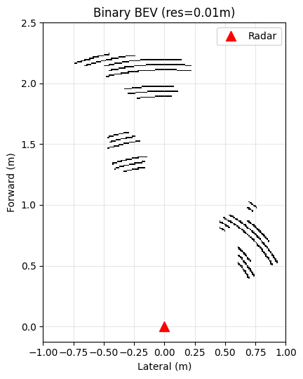
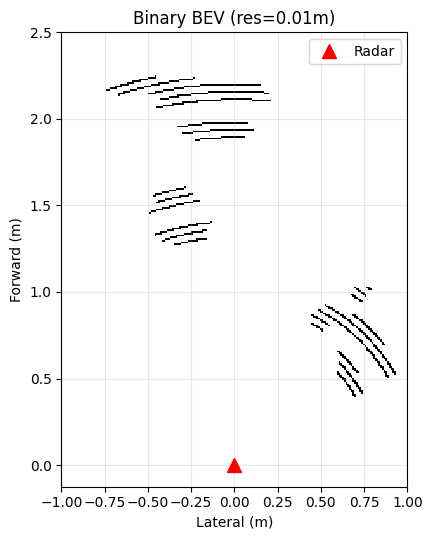
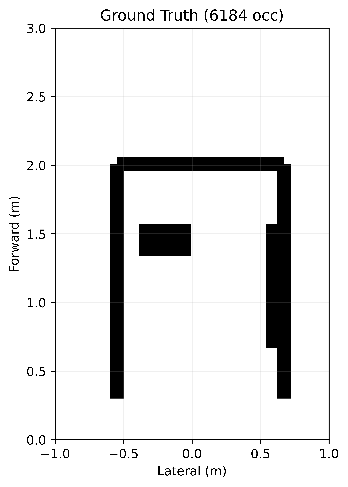
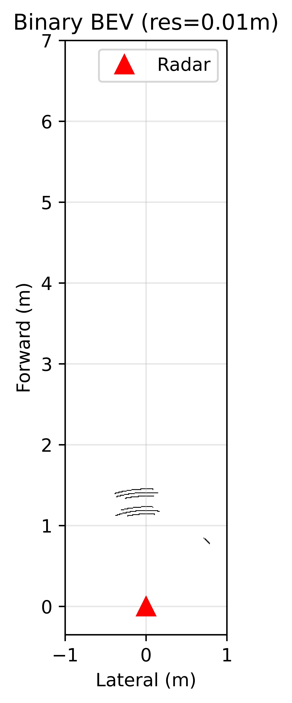
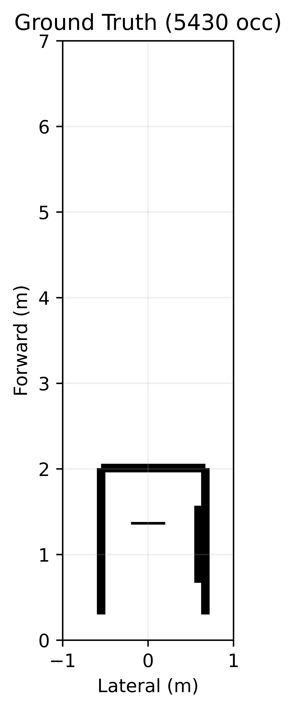

# radar-camera-bev-evaluation

Comparative evaluation of **mmWave radar** and **depth camera** 2D occupancy grids against hand-measured ground truth in a controlled indoor environment.

## What This Project Does

Both sensors observe the same static indoor scene (a narrow hallway with obstacles). Each sensor produces a binary occupancy grid — a top-down map where each cell is either "occupied" or "free". This project evaluates how accurately each sensor reconstructs the scene by comparing its occupancy grid against ground truth measurements.

## Sensors

| Sensor | Model | Key Specs |
|--------|-------|-----------|
| Radar | TI xWR68xx AOP | 3TX × 4RX, Capon/Bartlett beamforming, 0.044m range res |
| Camera | Intel RealSense D455 | 848×480 depth, 86° FOV, stereo IR |

## Scenes

Room: 122cm wide hallway, sensor 55cm from left wall, front wall at 201cm.

| Scene | Description |
|-------|-------------|
| 1 | Suitcase |
| 2 | Mirror |

Each scene tested under **light** and **dark** conditions. Camera additionally tested with/without IR projector.

## Results

### Scene Comparison (Light condition)

| Scene | Radar light | Camera light | Radar Dark | Camera Dark | GT |
|:-----:|:---------:|:----------:|:--:|:-------------:|:--------------:|
| 1 — Suitcase |  |   |  |  |  |
| 2 — Mirror |  |  |  |  | |

### Grid-level Metrics

| Scene | Sensor | IoU | Precision | Recall | F1 |
|:-----:|:------:|:---:|:---------:|:------:|:--:|
| 1 | Radar  | — | — | — | — |
| 1 | Camera | — | — | — | — |
| 2 | Radar  | — | — | — | — |
| 2 | Camera | — | — | — | — |
| 3 | Radar  | — | — | — | — |
| 3 | Camera | — | — | — | — |

### Cluster-level Metrics

| Scene | Sensor | Hungarian Mean Error (m) | OSPA (m) | OSPA_loc | OSPA_card |
|:-----:|:------:|:------------------------:|:--------:|:--------:|:---------:|
| 1 | Radar  | — | — | — | — |
| 1 | Camera | — | — | — | — |
| 2 | Radar  | — | — | — | — |
| 2 | Camera | — | — | — | — |
| 3 | Radar  | — | — | — | — |
| 3 | Camera | — | — | — | — |

